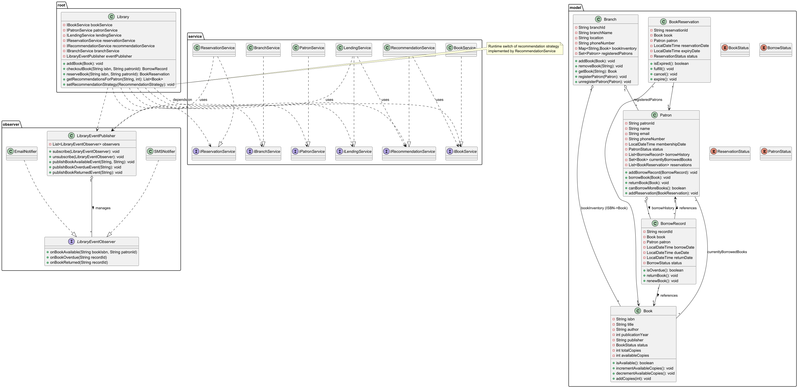

# Library Management System (LLD)

## Overview

A concise, well-structured Java-based Library Management System demonstrating core low-level design (LLD) concepts: domain models for books, patrons, lending and branches, layered services, and basic event notification.

## Core Features

- Book management: add/update/remove books, track copies and availability
- Patron management: register/update patrons, track borrowing history
- Lending: checkout, return, renew, due-date calculation, borrow limits
- Inventory: per-branch inventories and availability checks
- Reservations: reserve checked-out books with expiry and notifications
- Notifications: pluggable observers (e.g., email/SMS) for key events
- Recommendations (basic): popular/similar book suggestions

## Class Diagrams

